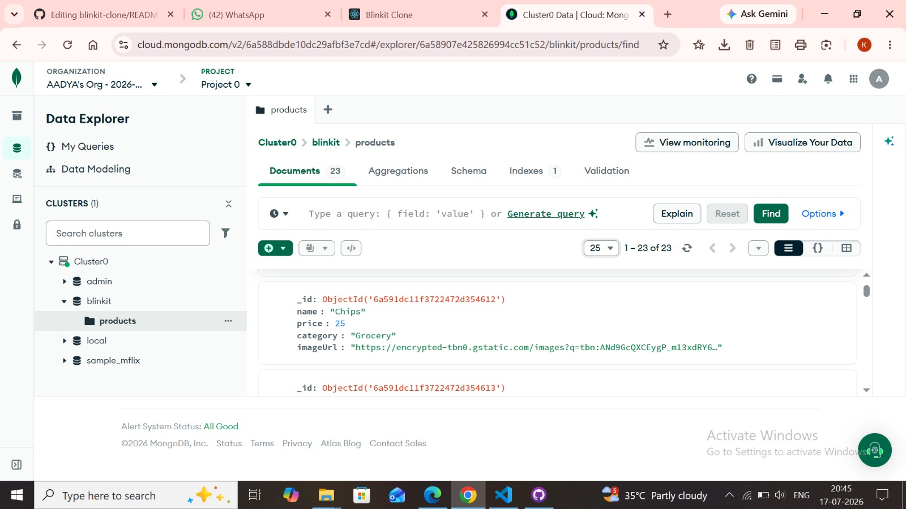
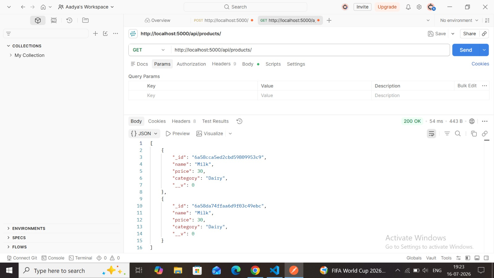
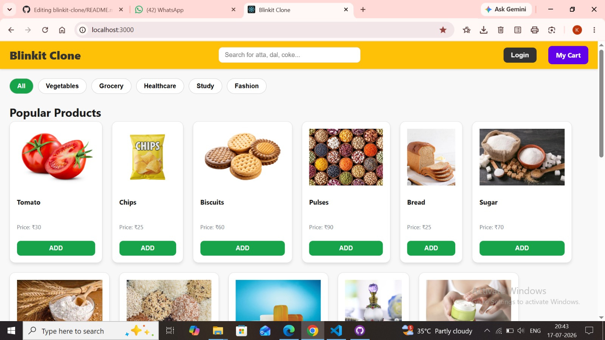

# Blinkit Clone

A responsive, feature-rich grocery delivery web application clone built to mimic the core functionality of Blinkit.

## 🚀 Features
- **Product Catalog**: Dynamic display of products with prices and images.
- **Search & Filter**: Search functionality and category-based navigation.
- **Shopping Cart**: Real-time cart management using Context API.
- **Authentication**: User Login/Signup flow with simulated OTP verification.
- **Responsive Design**: Clean and modern UI optimized for various screen sizes.

## 🛠 Tech Stack
- **Frontend**: React.js, CSS3
- **Backend**: Node.js, Express.js
- **Database**: MongoDB
- **State Management**: React Context API
<p align="center">
  
</p>

<p align="center">
  
</p>
<p align="center">
  
</p>


## 📋 Getting Started

### Prerequisites
- Node.js installed
- MongoDB installed/connected

### Installation
1. Clone the repository:
   ```bash
   git clone https://github.com/aadyadixit17-code/blinkit-clone
